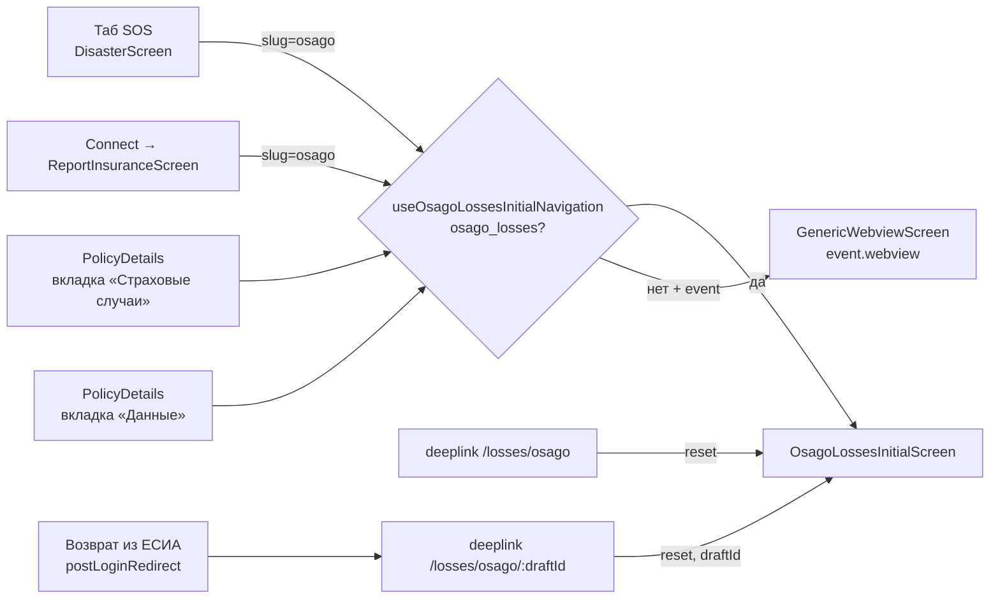

# Внешние входы в модуль

Во все входы попадают через **один экран**: [[OsagoLossesInitialScreen]]. Других экранов модуля снаружи никто не открывает.

## Общий хук `useOsagoLossesInitialNavigation`

`src/modules/OsagoLosses/hooks/useOsagoLossesInitialNavigation.ts`

```ts
goToOsagoLosses(event?: InsuranceEvent)
  osago_losses.isEnabled → navigate('OsagoLossesInitialScreen')          // без draftId
  иначе, если передан event → navigate('GenericWebviewScreen', { uri: event.webview })
  иначе → ничего
```

Возвращает ещё `isOsagoLossesLoading: false`. Это захардкоженная заглушка, её никто не использует.

## Точки входа

| # | Где в приложении | Файл | Условие показа | Что вызывает |
|---|---|---|---|---|
| 1 | Таб **SOS** (`Disaster`) → список страховых событий | `modules/Disaster/screens/DisasterScreen.tsx` | событие с `event.slug === 'osago'` из `useGetInsuranceEventsQuery` | `goToOsagoLosses(event)`: при выключенном флаге уходит в webview события |
| 2 | Таб **Связь** (`Connect`) → «Сообщить о страховом случае» → `ReportInsuranceScreen` | `modules/Connect/screens/ReportInsuranceScreen.tsx` | то же: `event.slug === 'osago'` | `goToOsagoLosses(event)` |
| 3 | Детали полиса → вкладка **«Страховые случаи»** | `modules/Policies/components/PolicyDetails/PolicyDetailsLossesClaimsContent.tsx` (кнопка), обработчик в `PolicyDetails.tsx` | `osago_losses.isEnabled && policyType === 'OSAGO'` | `goToOsagoLosses()` + событие `policy_osago_click_button_declare_page_insurance_cases` |
| 4 | Детали полиса → вкладка **«Данные»** → ячейка «Заявить о страховом случае» | `modules/Policies/hooks/kaskoOsago.ts` (секция), `BoxedRouteCell.tsx` (route `declareOsagoLosses`) | `isOsagoLossesEnabled && policy.type === 'OSAGO'` | `goToOsagoLosses()` |
| 5 | Deeplink `…/losses/osago` | `osagoLossesLinkHandler.ts` → `utils/hooks/useLinkHandler/linkHandler.ts` | без проверки фичефлага | `navigation.reset([RootTabs, OsagoLossesInitialScreen])` |
| 6 | Deeplink `…/losses/osago/:draftId` | там же | без проверки фичефлага | `reset([RootTabs, OsagoLossesInitialScreen{ draftId }])` |
| 7 | **Возврат после входа через ЕСИА** (из [[OsagoLossesInitialScreenGU]]) | native: `auth.postLoginRedirect` в Redux → `useLinkHandler.tsx`; web: `localStorage[postLogin]` → `useLinkHandler.web.tsx` | — | Тот же deeplink #6 `/losses/osago/{draftId}` |

> [!warning] Важные нюансы
> - Deeplink-и (#5–#7) **не проверяют** `osago_losses`. По прямой ссылке флоу откроется даже при выключенном флаге.
> - Во входах #3 и #4 `goToOsagoLosses()` вызывается **без event**. Если флаг выключится между рендером и тапом, ничего не произойдёт (fallback в webview нет). На практике кнопки скрыты флагом.
> - `navigation.reset` в deeplink-ах сбрасывает стек до `[RootTabs, Initial]`, поэтому «назад» с Initial ведёт на табы.
> - Входы #1–#4 делают `navigate` поверх текущего стека, и «назад» возвращает туда, откуда пришёл пользователь.

## Схема



## Выходы из модуля наружу

| Откуда | Куда | Зачем |
|---|---|---|
| [[OsagoLossesInitialScreen]] | `Linking.openURL('https://www.gosuslugi.ru/europrotokol')` | Оформить европротокол |
| [[OsagoLossesInitialScreen]] | `callPhoneNumber('112')` | Звонок в экстренные службы |
| [[OsagoLossesInitialScreenGU]] | `GenericWebviewScreen` (ЕСИА) | Вход через Госуслуги |
| [[OsagoLossesDocumentSignScreen]] | Ссылки на согласия (ПДн, реклама), скачивание PDF печатных форм | — |
| [[OsagoLossesSuccessScreen]] | `GenericWebviewScreen` (карточка страхового случая в ЛК), `RootTabs → Health → HealthScreen` | — |
| [[OsagoLossesFailureScreen]] | `mailto:SUPPORT_EMAIL` | Поддержка |

Связанное: [[02 Флоу и навигация]], [[05 Ветвления и бизнес-правила]].
