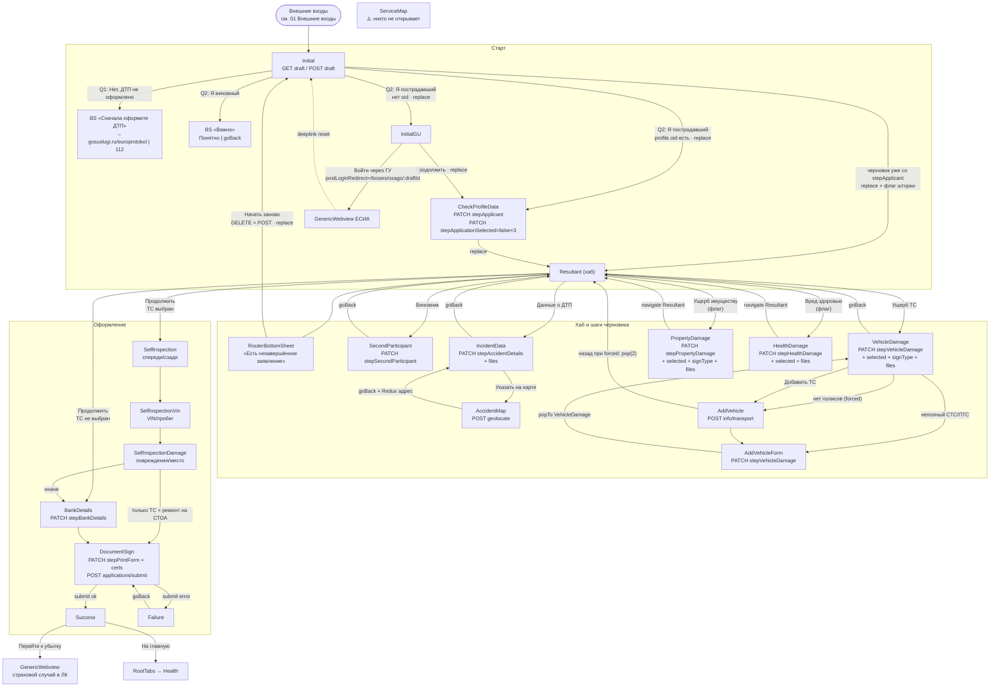

# Флоу и навигация

Визуальная карта: [[Карта клиентского пути.canvas]]. Здесь то же в Mermaid, плюс текстовые сценарии и таблица переходов.

## Ключевая идея архитектуры

- **Черновик (`draftId`) — единственный источник правды.** Почти каждый экран получает `draftId` в параметрах роута, читает черновик (`GET drafts/{id}`) и при сохранении PATCH-ит свой `steps.stepXxx`.
- **[[OsagoLossesResultantScreen]] — хаб.** Экраны шагов открываются с хаба и возвращаются на него (`goBack` / `navigate('Resultant')`). Так что флоу «звезда + хвост»: сначала заполняется звезда вокруг хаба, потом идёт линейный хвост «самоосмотр → реквизиты → подписание».
- Все PATCH-мутации инвалидируют тег `{ type: 'osagoLosses', id: draftId }`. После сохранения хаб и печатные формы перезапрашиваются автоматически.
- Локальный Redux (`osagoLossesStore`) нужен только для передачи данных между экранами без бэка: адрес с карты, флаг показа шторки, выбранные на хабе типы ущерба. См. [[04 Модель данных#Redux osagoLossesStore]].

## Полная схема

## Сценарии

### 1. Новый пользователь без Госуслуг (happy path, только ущерб ТС)
1. Вход (SOS, полис или deeplink) → **Initial**. Без `draftId` выполняется `POST claims/draft`, и черновик создаётся сразу при открытии экрана.
2. «Да, через Европротокол или ГИБДД» → «Я пострадавший». `profile.oid` нет → `replace` **InitialGU**.
3. «Продолжить» → `replace` **CheckProfileData**. Форма предзаполнена из `GET info/driver` и `GET /api/v1/profile`. Сохранение: `PATCH stepApplicant` (signType=`pep`), затем `PATCH stepApplicationSelected` (всё `false`) → `replace` **Resultant**.
4. На хабе пользователь по очереди заполняет **Виновник**, **Данные о ДТП** и **Ущерб ТС**. Кнопка «Продолжить» активна, только когда есть `stepSecondParticipant`, `stepAccidentDetails` и хотя бы один ущерб.
5. «Продолжить». `isVehicleApplicationSelected = true` (его выставил VehicleDamage) → **SelfInspection** → **Vin** → **Damage**.
6. Способ возмещения «деньги» → **BankDetails** → `PATCH stepBankDetails` → **DocumentSign**.
7. signType=`pep`: галочки → `PATCH stepPrintForm` → `PATCH stepUploadedDocuments.claimCaseFileListPrintFormCertificates` → `POST applications/submit` → **Success**.

### 2. Пользователь с Госуслугами (`oid` есть)
Initial → сразу **CheckProfileData** (GU пропускается). При сохранении ущерба ТС или имущества signType меняется на `goskey`. На DocumentSign основная кнопка называется «Подписать через Госключ», вторичная — «Подписать ПЭП» (`switchToPep`).

### 3. Вход через ЕСИА с экрана GU
GU → «Войти через Госуслуги». Сохраняется `postLoginRedirect = /losses/osago/{draftId}` (native: Redux `auth`, web: `localStorage`), затем открывается webview ЕСИА. После логина link handler делает `reset([RootTabs, Initial{draftId}])`. Initial загружает черновик. `stepApplicant` в нём ещё нет, поэтому вопросы показываются заново, и теперь ветка `oid` ведёт в CheckProfile.

### 4. Продолжение незавершённого черновика
Deeplink `/losses/osago/:draftId` (или ЕСИА-редирект после CheckProfile) → Initial. В черновике уже есть `stepApplicant` → `dispatch(scheduleShowDraftRouterBottomSheet())` и `replace` **Resultant**. На маунте хаба открывается **RouterBottomSheet**:
- «Продолжить оформление» → остаёмся на хабе;
- «Начать заново» → `DELETE drafts/{id}` → `POST claims/draft` → `replace Initial{newDraftId}`.

> [!note] Автоматического поиска «последнего черновика» нет
> Без `draftId` в роуте всегда создаётся **новый** черновик. Продолжить старый можно только по deeplink с `draftId`.

### 5. Нет полисов ОСАГО у пользователя
VehicleDamage: после фильтрации (`product !== 'е-ОСАГО'`) список пуст → `navigate AddVehicle{ isForcedTransition: true }`. «Назад» на AddVehicle делает `pop(2)`, то есть возвращает на хаб, минуя пустой VehicleDamage.

### 6. Юрлицо-собственник (УКЭП)
Собственник ТС или имущества `legal_entity` → signType=`ukep`. На DocumentSign для каждой печатной формы нужно загрузить файл открепленной подписи `.sig`. Кнопка — «Отправить».

## Таблица переходов

| Откуда | Действие | Куда | Метод |
|---|---|---|---|
| Initial | черновик со `stepApplicant` | Resultant | `replace` |
| Initial | пострадавший + `oid` | CheckProfileData | `replace` |
| Initial | пострадавший без `oid` | InitialGU | `replace` |
| Initial | виновный → «Вернуться на главную» | назад | `goBack` |
| InitialGU | «Продолжить» | CheckProfileData | `replace` |
| InitialGU | «Войти через ГУ» | GenericWebviewScreen (ЕСИА) | `navigate` |
| CheckProfileData | сохранить | Resultant | `replace` |
| Resultant | карточки | SecondParticipant / IncidentData / VehicleDamage / PropertyDamage / HealthDamage | `navigate` |
| Resultant | «Продолжить», ТС выбран | SelfInspection | `navigate` |
| Resultant | «Продолжить», ТС не выбран | BankDetails | `navigate` |
| Resultant | назад → «Закрыть» | предыдущий экран вне модуля | `goBack` |
| RouterBottomSheet | «Начать заново» | Initial{newDraftId} | `replace` |
| SecondParticipant | сохранить | Resultant | `goBack` |
| IncidentData | «Указать на карте» | AccidentMap{initialPlace} | `navigate` |
| AccidentMap | «Сохранить» | IncidentData (через Redux) | `goBack` |
| IncidentData | сохранить | Resultant | `goBack` |
| VehicleDamage | нет полисов | AddVehicle{forced:true} | `navigate` |
| VehicleDamage | «Добавить ТС» в шторке | AddVehicle{forced:false} | `navigate` |
| VehicleDamage | неполный документ ТС, VIN-фолбэк не помог | AddVehicleForm{returnToVehicleDamageScreen:true} | `navigate` |
| VehicleDamage | сохранить | Resultant | `goBack` |
| AddVehicle | найти | AddVehicleForm{transport} | `navigate` |
| AddVehicle | назад, forced | Resultant | `pop(2)` |
| AddVehicleForm | сохранить | VehicleDamage{filledRegistrationDocument?} | `popTo` |
| AddVehicleForm | закрыть → подтвердить | Resultant | `popTo` |
| PropertyDamage / HealthDamage | сохранить | Resultant | `navigate` |
| SelfInspection → Vin → Damage | продолжить | следующий | `navigate` |
| SelfInspectionDamage | только ТС и ремонт | DocumentSign | `navigate` |
| SelfInspectionDamage | иначе | BankDetails | `navigate` |
| BankDetails | продолжить | DocumentSign | `navigate` |
| DocumentSign | submit ok | Success{claimId, extDocNumber} | `navigate` |
| DocumentSign | submit error | Failure | `navigate` |
| Failure | «Повторить попытку» | DocumentSign | `goBack` |
| Success | «Перейти к убытку» | GenericWebviewScreen «Детали убытка» | `navigate` |
| Success | «На главную» | RootTabs → Health → HealthScreen | `navigate` |

## Параметры роутов (`OsagoLossesStackParamList`)

| Экран | Параметры |
|---|---|
| OsagoLossesInitialScreen | `{ draftId?: string } \| undefined` |
| OsagoLossesSuccessScreen | `{ claimId: string; extDocNumber: string }` |
| OsagoLossesFailureScreen | `undefined` |
| OsagoLossesAddVehicleScreen | `{ draftId; isForcedTransition: boolean }` |
| OsagoLossesAddVehicleFormScreen | `{ draftId; transport: TransportType \| null; returnToVehicleDamageScreen?: boolean }` |
| OsagoLossesVehicleDamageScreen | `{ draftId; filledRegistrationDocument?: VehicleRegistrationDocumentType }` |
| OsagoLossesAccidentMapScreen | `{ draftId; initialPlace?: string /* "lat, lon" */ }` |
| Остальные | `{ draftId: string }` |

> [!bug] Мёртвые типы
> В `ParamList` объявлены `OsagoLossesCulpritScreen` и `OsagoLossesPosessionDamageScreen`, но в стеке таких экранов нет. См. [[08 Тех долг и странности]].
