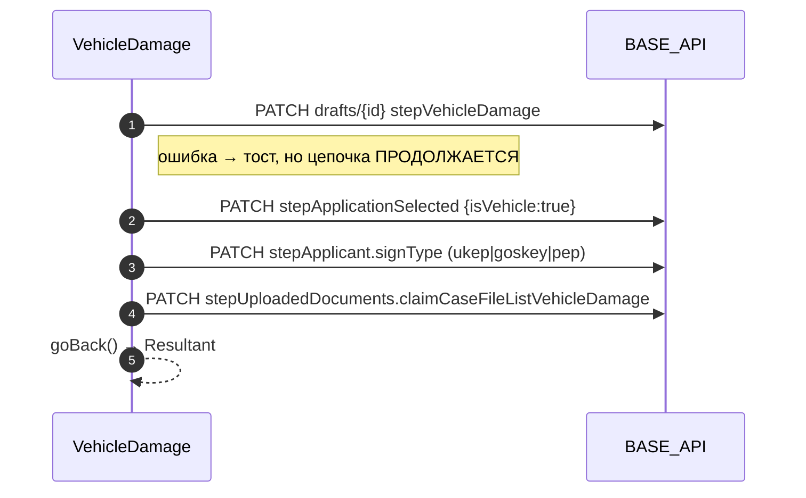
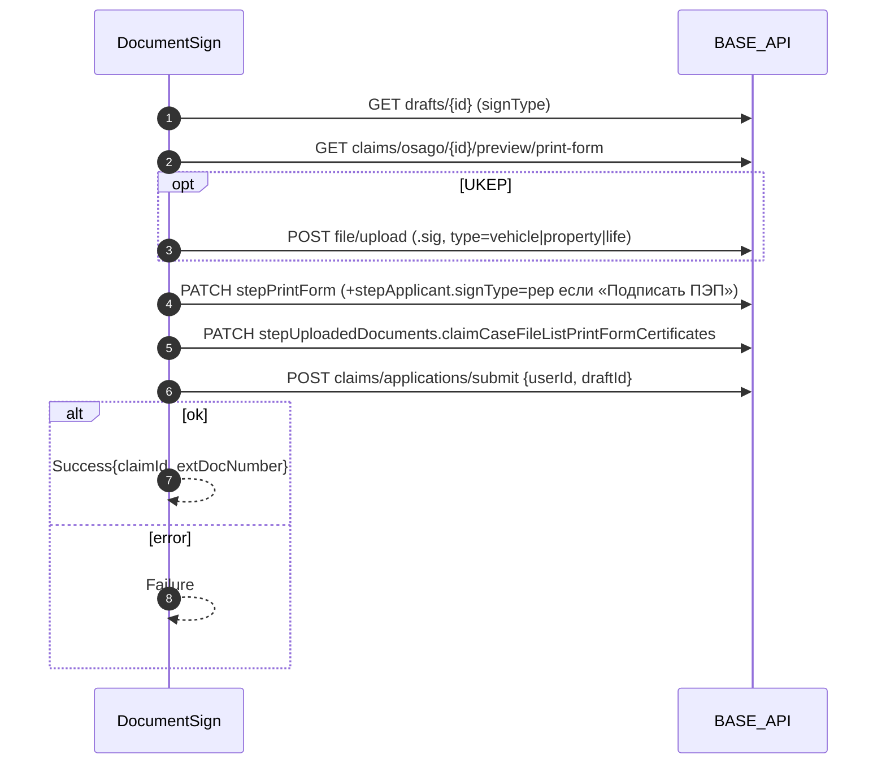

# API модуля ОСАГО Убытки

Все запросы идут через `mainApiGateway` (RTK Query, `baseUrl = config.BASE_API`). Пути без ведущего `/` (`api/storefront/...`) резолвятся относительно того же `BASE_API`.

Тег кэша: `{ type: 'osagoLosses', id: draftId }`. Его отдают `GET drafts/{id}` и `GET print-form`, а инвалидируют **все PATCH**, кроме `stepApplicant` и `signType`, и `submit`.

## Черновик (draft)

| Method | URL | Хук | Тело / параметры | Где вызывается |
|---|---|---|---|---|
| POST | `api/storefront/claims/draft` | `useCreateOsagoLossesDraftMutation` | `{ productType: 'OSAGO' }` → `{ draftId, status, productType, steps?, createdAt }` | [[OsagoLossesInitialScreen]] (через `useOsagoLossesDraftResolver`), [[OsagoLossesRouterBottomSheet]] |
| GET | `api/storefront/claims/drafts/{draftId}` | `useGetOsagoLossesDraftByIdQuery` | → `{ steps: StepsType }` | почти все экраны |
| DELETE | `api/storefront/claims/drafts/{draftId}` | `useDeleteOsagoLossesDraftMutation` | — | [[OsagoLossesRouterBottomSheet]] («Начать заново») |
| PATCH | `api/storefront/claims/drafts/{draftId}` | см. таблицу ниже | `{ steps: { stepXxx: … } }` | все экраны шагов |

### PATCH `drafts/{draftId}`: какие шаги пишутся

Один URL и один метод, но 11 разных мутаций. Каждая пишет свой кусок `steps`.

| Мутация | Шаг в body | Что отправляется | Экран |
|---|---|---|---|
| `patchOsagoLossesApplicant` | `stepApplicant` | `{ role:'victim', type:'OSAGO', status:'draft', signType:'pep', oid, applicant }` | [[OsagoLossesCheckProfileDataScreen]] |
| `patchOsagoLossesApplicantSignType` | `stepApplicant.signType` | `'pep' \| 'goskey' \| 'ukep'` | [[OsagoLossesVehicleDamageScreen]], [[OsagoLossesPropertyDamageScreen]] |
| `patchOsagoLossesApplicantSelected` | `stepApplicationSelected` | `{ isVehicle/isProperty/isLifeApplicationSelected }` | CheckProfile (все `false`), VehicleDamage (`isVehicle:true`), PropertyDamage (`isProperty:true`), HealthDamage (`isLife:true`) |
| `patchOsagoLossesSecondParticipant` | `stepSecondParticipant` | `{ secondParticipant }` | [[OsagoLossesSecondParticipantScreen]] |
| `patchOsagoLossesAccidentDetails` | `stepAccidentDetails` | `{ accident }` | [[OsagoLossesIncidentDataScreen]] |
| `patchOsagoLossesVehicleDamage` | `stepVehicleDamage` | `{ policyNumber?, damagedVehicle }` | [[OsagoLossesVehicleDamageScreen]], [[OsagoLossesAddVehicleFormScreen]] |
| `patchOsagoLossesPropertyDamage` | `stepPropertyDamage` | `{ lostProperty, propertyOwner }` | [[OsagoLossesPropertyDamageScreen]] |
| `patchOsagoLossesHealth` | `stepHealthDamage` | `{ injured }` | [[OsagoLossesHealthDamageScreen]] |
| `patchOsagoUploadedDocumentsStep` | `stepUploadedDocuments.{fileListKey}` | массив `ClaimCaseFileListType[]` по ключу `claimCaseFileList{VehicleDamage\|AccidentDetails\|HealthDamage\|PropertyDamage\|PrintFormCertificates}` | Incident, VehicleDamage, Property, Health, DocumentSign |
| `changeOsagoStepDraft` | `stepPhotoDamage` (generic) | `{ frontView, backView, vinView, mialeageView, damageDistanceView, damageCloseupView, accidentLocationView }: { photoList }` | самоосмотр (3 экрана) |
| `patchOsagoLossesBankDetails` | `stepBankDetails` | `{ bankDetails \| postalAddress, beneficiary }` | [[OsagoLossesBankDetailsScreen]] |
| `patchOsagoLossesPrintForm` | `stepPrintForm` (+ опц. `stepApplicant.signType='pep'`) | `{ dataConfirmation, personalDataConsent, marketingConsent, printForm[] }` | [[OsagoLossesDocumentSignScreen]] |

## Подписание и отправка

| Method | URL | Хук | Параметры | Где |
|---|---|---|---|---|
| GET | `api/storefront/claims/osago/{draftId}/preview/print-form` | `useGetOsagoLossesPrintFormQuery` | → `[{ hash, type:'life'\|'property'\|'vehicle', source, fileName, categoryCode, documentumId }]` | [[OsagoLossesDocumentSignScreen]] (`useGetPrintFormLists`) |
| GET | `{BASE_API}/api/storefront/claims/osago/documentum/{documentumId}` | — (`downloadAndOpenFile`) | скачивание PDF печатной формы | [[OsagoLossesDocumentSignScreen]] |
| POST | `api/storefront/claims/applications/submit` | `useSubmitOsagoLossesApplicationMutation` | `{ userId, draftId }` → `{ applicationId, claimId, extClaimId, extDocNumber }` | [[OsagoLossesDocumentSignScreen]] |

## Справочники и автоподстановка

| Method | URL | Хук | Параметры | Где |
|---|---|---|---|---|
| GET | `api/storefront/claims/polices?type=OSAGO` | `useGetOsagoPoliciesQuery` | → `Policy & { imageUrl, customPolicy… }[]` | [[OsagoLossesResultantScreen]] (прогрев кэша), [[OsagoLossesVehicleDamageScreen]] |
| GET | `api/storefront/claims/osago/dictionary?category=…` | `useGetOsagoLossesDictionaryQuery` | `category: 'insurance_company' \| 'bank' \| 'car'` | [[OsagoLossesSecondParticipantScreen]] (`insurance_company`) |
| POST | `api/storefront/claims/osago/dictionary/values?category=car` | `useGetOsagoLossesCarDictionaryQuery` | `{ values: [brand] }` → `imageUrl` логотипа | `useCreateNewPolicyFromVehicle` (VehicleDamage) |
| GET | `api/storefront/claims/osago/dictionary/car/{carId}/image` | `useGetCarImageUrlQuery` | — | ⚠️ **не используется** |
| GET | `api/storefront/claims/info/driver` | `useGetDriverClaimInfoQuery` | → `OsagoLossesProfile` (ФИО, документ, адрес, контакты) | [[OsagoLossesCheckProfileDataScreen]] (`useCheckProfileDataForm`, `useApplicantCommunicationMethods`) |
| GET | `api/storefront/claims/info/driver` | `useGetDriverInfoQuery` (тип `any`) | — | ⚠️ **не используется**, дубль предыдущего (FIXME в коде) |
| GET | `api/storefront/claims/info/transport/{policyId}` | `useLazyGetTransportByPolicyNumberQuery` | → `{ transport, drivers[], owner? }` | [[OsagoLossesVehicleDamageScreen]] |
| POST | `api/storefront/claims/info/transport` | `useGetTransportClaimInfoMutation` | `{ queryType: 'GRZ'\|'VIN'\|'BODY_NUMBER'\|'CHASSIS_NUMBER', query }` → `{ transport }` | [[OsagoLossesAddVehicleScreen]], [[OsagoLossesSecondParticipantScreen]] (`useSecondParticipantVehicleInfo`), [[OsagoLossesVehicleDamageScreen]] (VIN-фолбэк) |
| GET | `api/storefront/bank-requisites` | `useGetOsagoLossesBankRequisitesQuery` | → сохранённые реквизиты; **на клиенте** в конец добавляется элемент «Почтовый перевод» | [[OsagoLossesBankDetailsScreen]] |
| GET | `api/storefront/suggestions/bank?query={bik}` | `useLazyGetBankDetailsByBikQuery` | → `{ suggestions: [{ name, kpp, bik, correspondentAccount, accountNumber, postalCode, inn }] }` | [[OsagoLossesBankDetailsScreen]] |
| POST | `/api/storefront/suggestions/geolocate/address` | `useLazyGetDadataAddressByCoordinatesQuery` (`slice/osagoLossesApi.ts`) | `{ lat, lon }` → `suggestions[]` | [[OsagoLossesAccidentMapScreen]] |

## Файлы

| Method | URL | Хук | Тело | Где |
|---|---|---|---|---|
| POST | `api/storefront/file/upload` | `useOsagoLossesUploadFileMutation` | `multipart/form-data`: `file` + `request` (JSON `{ categoryCode, type? }`) → `ClaimCaseFileListType { hash, fileId, source, fileName, categoryCode }` | `useFileUploadHandlers` (Incident, VehicleDamage, Property, Health, UKEP-подписи) и `useSelfInspectionPhotos` |

Загрузка файла и привязка к черновику — **два разных шага**. Сначала `POST file/upload` при выборе файла, потом при «Сохранить» массив результатов уходит в `PATCH stepUploadedDocuments.{key}` (или в `stepPhotoDamage` для самоосмотра). Ключ перезаписывается целиком. Категории перечислены в [[09 Документы и UUID]].

## Внешние API модуля (из других слайсов)

| Method | URL | Хук | Где |
|---|---|---|---|
| GET | `/api/v1/profile` | `useGetProfileQuery` (Auth) | Initial (`oid`), CheckProfile, Vehicle/Property/Health (подстановка, signType), Bank (ФИО), DocumentSign (`userId`) |
| — | подсказки адресов (DaData) | `useAddressSuggestions` (общий хук) | CheckProfile, IncidentData, AccidentMap, формы собственника, водителя, пострадавшего и т.д. |
| GET | страховые события | `useGetInsuranceEventsQuery` (Disaster) | точки входа, см. [[01 Внешние входы]] |

## Последовательности запросов при «Сохранить»

Порядок вызовов на остальных экранах описан в заметках экранов.
