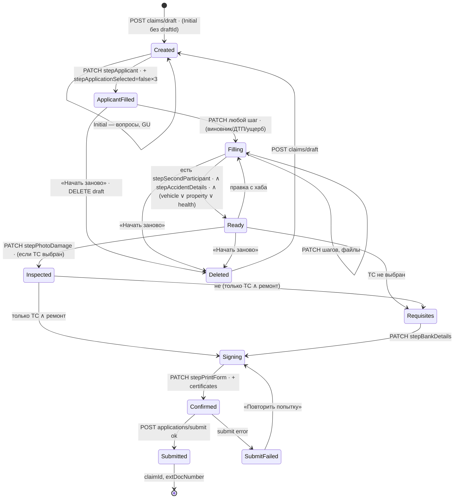
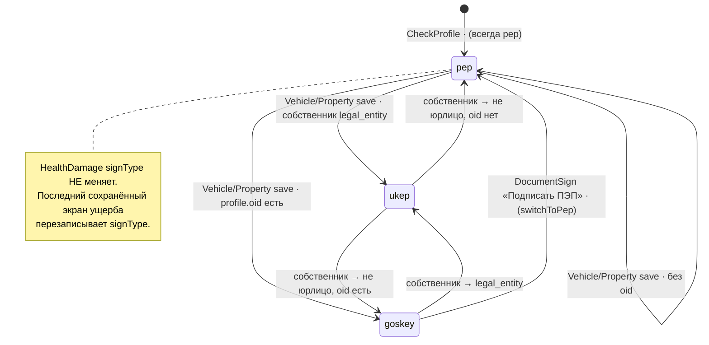
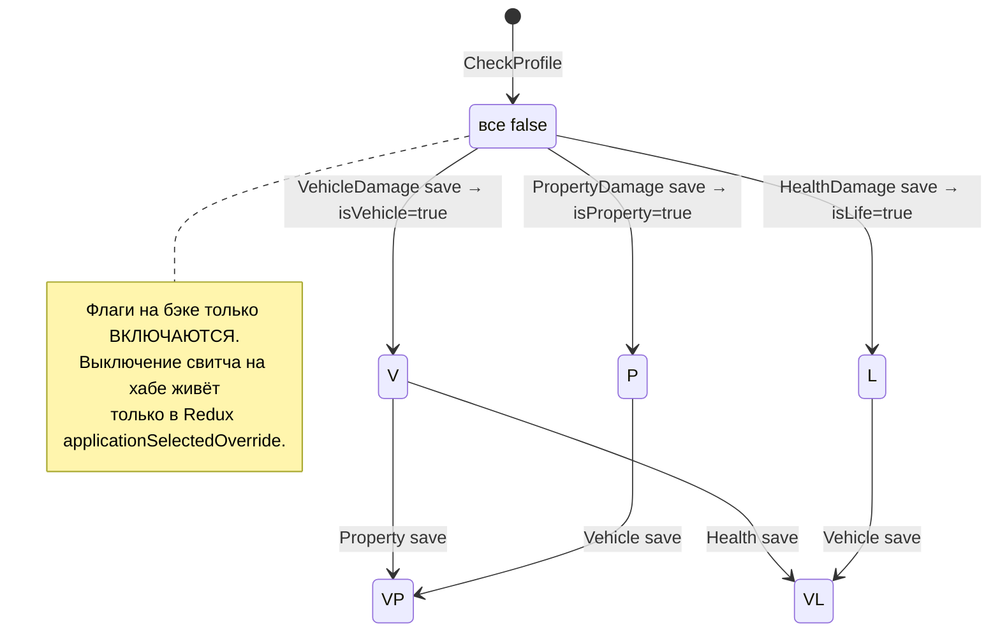

# Модель данных

Три представления одной сущности **«Заявление о страховом случае ОСАГО» (Draft → Claim)**:
- **(а)** доменная ER-модель: сущности и связи;
- **(б)** единая TypeScript-модель черновика, собранная из `osagoLossesSlice/types.ts` и `types.ts`;
- **(в)** state machine: жизненный цикл черновика, `signType` и выбора типов ущерба.

Источники: `osagoLossesSlice/types.ts` (серверные типы), `types.ts` (типы форм), `slice/osagoLossesStore.tsx` (Redux).

---

## (а) Доменная модель (ER)

```mermaid
erDiagram
  DRAFT ||--|| APPLICANT : "stepApplicant"
  DRAFT ||--o| SECOND_PARTICIPANT : "stepSecondParticipant"
  DRAFT ||--o| ACCIDENT : "stepAccidentDetails"
  DRAFT ||--o| DAMAGED_VEHICLE : "stepVehicleDamage"
  DRAFT ||--o| PROPERTY_DAMAGE : "stepPropertyDamage"
  DRAFT ||--o| INJURED : "stepHealthDamage"
  DRAFT ||--o| PHOTO_DAMAGE : "stepPhotoDamage"
  DRAFT ||--o| BANK_DETAILS : "stepBankDetails"
  DRAFT ||--o| PRINT_FORM_STEP : "stepPrintForm"
  DRAFT ||--|| APPLICATION_SELECTED : "stepApplicationSelected"
  DRAFT ||--o{ UPLOADED_FILE : "stepUploadedDocuments.*"
  DRAFT ||--o| CLAIM : "submit"

  SECOND_PARTICIPANT ||--|| SECOND_VEHICLE : "secondVehicle"
  SECOND_PARTICIPANT }o--o| INSURANCE_COMPANY : "insuranceCompany (dictionary)"
  DAMAGED_VEHICLE ||--o| VEHICLE_OWNER : "propertyOwnerVehicle"
  DAMAGED_VEHICLE ||--o| DRIVER : "driver (нет, если isVehicleNotDriven)"
  DAMAGED_VEHICLE ||--|| REGISTRATION_DOCUMENT : "registrationDocument"
  DAMAGED_VEHICLE ||--o{ COMPENSATION : "compensationMethods.vehicleCompensation[]"
  DAMAGED_VEHICLE }o--o| OSAGO_POLICY : "policyNumber"
  PROPERTY_DAMAGE ||--o{ LOST_PROPERTY : "lostProperty[]"
  PROPERTY_DAMAGE ||--|| PROPERTY_OWNER : "propertyOwner"
  BANK_DETAILS ||--|| BENEFICIARY : "beneficiary"
  PRINT_FORM_STEP ||--o{ PRINT_FORM : "printForm[] (life/property/vehicle)"
  PHOTO_DAMAGE ||--o{ UPLOADED_FILE : "photoList[] × 7 ракурсов"

  DRAFT {
    string draftId PK
    string status
    string productType "OSAGO"
    string createdAt
  }
  APPLICANT {
    string role "victim"
    string type "OSAGO"
    string status "draft"
    enum signType "pep|goskey|ukep"
    number oid "ЕСИА id (если есть)"
    string fullName
    date birthDate
    Document identityDocument
    Address registrationAddress
    Contact[] communicationMethods
  }
  APPLICATION_SELECTED {
    bool isVehicleApplicationSelected
    bool isPropertyApplicationSelected
    bool isLifeApplicationSelected
  }
  ACCIDENT {
    date incidentDate
    string incidentTime "ЧЧ:ММ"
    string address "строка"
    Address addressObject
    string place "lat, lon | null"
    string circumstances
    enum protocolType "GIBDD|euroProtocol"
    number vehiclesInvolved
  }
  SECOND_PARTICIPANT {
    string fullName
    date birthDate
    string policyNumber "XXX0000000000 | null"
    string insuranceCompany
    Document identityDocument "ВУ/паспорт"
    Address registrationAddress
    Contact[] communicationMethods "телефон"
  }
  SECOND_VEHICLE {
    string brand
    string model
    string vinNumber
    string licensePlate
    number manufactureYear
    bool isVinNumberNotExists
  }
  DAMAGED_VEHICLE {
    string brand
    string model
    string vinNumber
    string bodyNumber
    string chassisNumber
    string licensePlate
    number manufactureYear
    bool isVinNumberNotExists
    bool isVehicleNotDriven
  }
  VEHICLE_OWNER {
    enum type "myself|individual|legal_entity"
    string fullName
    string legalName
    string inn
  }
  DRIVER {
    enum whoDriven "myself|individual"
    string fullName
  }
  COMPENSATION {
    enum method "repair|bankDetail"
    string stoaName "всегда null"
    string address "всегда null"
  }
  REGISTRATION_DOCUMENT {
    enum docType "sts|pts|epts"
    string docSeries
    string docNumber
    date issueDate
  }
  PROPERTY_OWNER {
    enum type "myself|individual|legal_entity"
    string fullName
    string legalName
    string inn
  }
  LOST_PROPERTY {
    string property
    string documentType
    string documentNumber
  }
  INJURED {
    enum victim "myself|individual"
    enum harmType "life|health"
    string fullName
    bool isLostEarning
    bool hasAdditionExpenses
    string injuryDetails
    string applicantRelation
  }
  BANK_DETAILS {
    string bic
    string bankName
    string bankInn
    string kpp
    string settlementAccount
    string correspondentAccount
    Address postalAddress "если почтовый перевод"
  }
  BENEFICIARY {
    string fullName
    enum type "myself|individual|legal_entity"
    string inn
    string legalName
  }
  PRINT_FORM {
    enum type "life|property|vehicle"
    string documentumId
    string fileName
    string hash
  }
  UPLOADED_FILE {
    string fileId
    string hash
    string source
    string fileName
    uuid categoryCode
  }
  CLAIM {
    string applicationId
    string claimId
    string extClaimId
    string extDocNumber "номер для пользователя"
  }
```



> [!warning] Расхождение: что отправляем и что читаем в `stepBankDetails`
> PATCH отправляет `{ bankDetails: { bik, inn, bankName, kpp, correspondentAccount, accountNumber } | postalAddress, beneficiary }`.
> А тип чтения `BankDetailsStepType` описан как `{ BankDetails: { bic, bankInn, settlementAccount… }, Beneficiary, postalAddress, inn, type, legalName }`, с **заглавными** ключами и другими именами полей. Клиент этот шаг не читает обратно, поэтому ошибки не видно, но тип врёт. Нужно сверить с бэком.

---

## (б) TypeScript-модель черновика (сводная)

Собрано в одно дерево, как это лежит в `GET drafts/{id}`. Комментарий у каждого шага: кто его пишет.

```ts
type OsagoLossesDraft = {
  draftId: string
  status: string
  productType: 'OSAGO'
  createdAt: string
  steps: {
    // CheckProfileData; signType меняют VehicleDamage/PropertyDamage/DocumentSign
    stepApplicant: {
      role: 'victim'
      type: 'OSAGO'
      status: 'draft'
      signType: 'pep' | 'goskey' | 'ukep'
      oid?: number
      applicant: Person & { communicationMethods: Contact[] }
    }

    // CheckProfile (все false), затем каждый экран ущерба ставит свой флаг в true
    stepApplicationSelected: {
      isVehicleApplicationSelected?: boolean
      isPropertyApplicationSelected?: boolean
      isLifeApplicationSelected?: boolean
    }

    // SecondParticipant
    stepSecondParticipant?: {
      secondParticipant: Person & {
        policyNumber: string | null           // нормализуется normalizeOsagoPolicyNumber
        insuranceCompany: string | null       // displayName из dictionary insurance_company
        identityDocument: DocumentShort       // по умолчанию ВУ
        communicationMethods: [{ type: 'phoneNumber'; value: string }]
        secondVehicle: {
          brand: string; model: string
          vinNumber?: string; licensePlate?: string   // взаимоисключающие
          isVinNumberNotExists?: boolean               // true, если ввели госномер
          manufactureYear?: number
          registrationDocument: RegistrationDocument
        }
      }
    }

    // IncidentData (+ AccidentMap через Redux)
    stepAccidentDetails?: {
      accident: {
        incidentDate: string; incidentTime: string   // 'ЧЧ:ММ'
        address: string; addressObject: Address
        place: string | null                         // 'lat, lon'
        circumstances: string
        protocolType: 'GIBDD' | 'euroProtocol'
        vehiclesInvolved: number
      }
    }

    // VehicleDamage, AddVehicleForm
    stepVehicleDamage?: {
      policyNumber?: string
      damagedVehicle: {
        brand: string; model: string
        vinNumber: string; bodyNumber: string; chassisNumber: string | null
        licensePlate: string; manufactureYear?: number
        isVinNumberNotExists: boolean | null
        isVehicleNotDriven?: boolean
        registrationDocument: RegistrationDocument
        propertyOwnerVehicle?: Person & {
          type: 'myself' | 'individual' | 'legal_entity'
          inn: string | null; legalName: string | null
          communicationMethods: Contact[]
        }
        driver?: Person & { whoDriven: 'myself' | 'individual'; communicationMethods: Contact[] }
        compensationMethods?: {
          vehicleCompensation: [{
            method: 'repair' | 'bankDetail'
            stoaName: null; address: null; addressObject: null  // выбор СТОА не реализован
          }]
        }
      }
    }

    // PropertyDamage
    stepPropertyDamage?: {
      lostProperty?: { property: string; documentType: string; documentNumber: string }[]
      propertyOwner: {
        type: 'myself' | 'individual' | 'legal_entity'
        fullName: string | null; birthDate: string | null
        inn: string | null; legalName: string | null
        identityDocument?: Document
        registrationAddress: Address
      }
    }

    // HealthDamage
    stepHealthDamage?: {
      injured: {
        victim: 'myself' | 'individual' | 'victim'
        harmType: 'life' | 'health' | null
        fullName: string; birthDate: string
        identityDocument: DocumentShort
        registrationAddress: Address
        isLostEarning: boolean; hasAdditionExpenses: boolean
        injuryDetails?: string                // только при health
        applicantRelation: string | null      // только при life (берётся из поля injuryDetails формы)
      }
    }

    // Самоосмотр (3 экрана)
    stepPhotoDamage?: Partial<Record<
      | 'frontView' | 'backView'
      | 'vinView' | 'mialeageView'
      | 'damageDistanceView' | 'damageCloseupView' | 'accidentLocationView',
      { photoList: UploadedFile[] }
    >>

    // BankDetails (формат записи)
    stepBankDetails?: {
      bankDetails?: { bik; inn; bankName; kpp; correspondentAccount; accountNumber }
      postalAddress?: Address                 // почтовый перевод
      beneficiary: { fullName; lastName; firstName; middleName; type; inn; legalName }
    }

    // DocumentSign
    stepPrintForm?: {
      dataConfirmation: boolean
      personalDataConsent: boolean
      marketingConsent: boolean
      printForm: PrintForm[]
    }

    // Все экраны с файлами
    stepUploadedDocuments: {
      claimCaseFileListVehicleDamage: UploadedFile[]
      claimCaseFileListAccidentDetails: UploadedFile[]
      claimCaseFileListHealthDamage: UploadedFile[]
      claimCaseFileListPropertyDamage: UploadedFile[]
      claimCaseFileListPrintFormCertificates: UploadedFile[]   // .sig для УКЭП
    }
  }
}

// Общие
type Person = {
  fullName: string; lastName?: string; firstName?: string; middleName?: string
  birthDate: string
  identityDocument: Document
  registrationAddress: Address
}
type Document = {
  docType: UuidDocumentType           // см. 09 Документы и UUID
  docSeries: string; docNumber: string; issueDate: string
  issuedBy?: string; filialCode?: string   // filialCode = код подразделения
}
type DocumentShort = Omit<Document, 'issuedBy' | 'filialCode'>
type RegistrationDocument = { docType: 'sts' | 'pts' | 'epts'; docSeries; docNumber; issueDate }
type Contact = { type: 'phoneNumber' | 'emailAddress'; value: string }
type Address = {             // AddressType из utils/hooks/useAddressSuggestions
  country; region; settlement; street; house; block; flat; postalCode
  rawValue?; kladrId?; fiasId?; cityKladrId?
}
type UploadedFile = { fileId?; hash?; source?; fileName?; categoryCode?: UuidDocumentType }
type PrintForm = { hash; type: 'life' | 'property' | 'vehicle'; source; fileName; categoryCode; documentumId }

// Результат submit
type Claim = { applicationId: string; claimId: string; extClaimId: string; extDocNumber: string }
```

### Вспомогательные серверные модели (не часть черновика)

```ts
// GET claims/polices?type=OSAGO, а также «виртуальный» полис, который собирается на клиенте
type OsagoLossesPolicy = Policy & {
  imageUrl: string
  customPolicy?: boolean                    // true → полис собран на клиенте из damagedVehicle (id = 'temp-…')
  customPolicyVIN?; customPolicyBrand?; customPolicyModel?
  customPolicyBodyNumber?; customPolicyChassisNumber?
  customPolicyManufactureYear?; customPolicyRegistrationDocument?
}

// GET info/transport/{policyId}
type TransportByPolicy = { transport: Transport; drivers: { fullName; birthdate; numberDriverLicense; dateIssueDriverLicense }[]; owner?: TransportOwner }
// POST info/transport
type Transport = { gosNumber; vinNumber; bodyNumber?; chassisNumber?; makeCar; modelCar; yearCar?; categoryCar; documentType /* 'СТС'|'ПТС'|'ЭПТС' */; seriesDocument; numberDocument; dateIssueDocument }

// GET info/driver: данные заявителя из внутренних систем
type OsagoLossesProfile = { lastName; firstName; middleName; birthdate; document: { type; documentSeries; documentNumber; issueDate; issueAuthority; departmentCode }; address: { country; region; city; street; houseNumber; flat }; communicationMethod: { type; value }[] }

// GET bank-requisites
type BankRequisitesItem = { name; shortName; bankBik; bankAccount; bik; inn; kpp; correspondentAccount; imageUrl; displayName; localId? }
```

### Redux `osagoLossesStore`

`slice/osagoLossesStore.tsx`, ключ `state.osagoLosses`.

| Поле | Пишет | Читает | Зачем |
|---|---|---|---|
| `shouldShowRouterBottomSheet` | [[OsagoLossesInitialScreen]] (`scheduleShowDraftRouterBottomSheet`) | [[OsagoLossesRouterBottomSheet]] (сбрасывает `draftRouterBottomSheetShown`) | Показать шторку «Есть незавершённое заявление» один раз |
| `selectedMapAddress` | [[OsagoLossesAccidentMapScreen]] | [[OsagoLossesIncidentDataScreen]] (на focus, затем обнуляет) | Передать адрес с карты обратно в форму |
| `selectedMapPlace` | [[OsagoLossesAccidentMapScreen]] | IncidentData, AccidentMap (центр карты) | Координаты `"lat, lon"` |
| `applicationSelectedOverride` | [[OsagoLossesResultantScreen]] («Продолжить») | [[OsagoLossesSelfInspectionDamageScreen]] (skip реквизитов), [[OsagoLossesBankDetailsScreen]] (список получателей) | Состояние свитчей «имущество / здоровье» на хабе. **На бэк не отправляется**, см. [[08 Тех долг и странности]] |

---

## (в) State machine

### Жизненный цикл черновика



Статусы `Ready`, `Inspected` и другие здесь **логические**: клиент выводит их из наличия шагов. Поле `draft.status` клиент не читает.

### `stepApplicant.signType`



От `signType` зависит [[OsagoLossesDocumentSignScreen]]:

| signType | Основная кнопка | Вторичная | Обязательно |
|---|---|---|---|
| `pep` | «Продолжить» | — | 2 чекбокса |
| `goskey` | «Подписать через Госусключ» (так в коде, с опечаткой) | «Подписать ПЭП» (`switchToPep`) | 2 чекбокса |
| `ukep` | «Отправить» | — | 2 чекбокса + `.sig` к каждой печатной форме |

### `stepApplicationSelected`



Связанное: [[03 API]], [[05 Ветвления и бизнес-правила]].
